# Complete Trade Import, Evaluation, and Tracking Flow

This diagram shows the full lifecycle of trades from import to payout in the DeltaLytix system.

```mermaid
graph TD
    %% IMPORT SOURCES
    START[User Initiates Trade Import] --> IMPORT_SOURCE{Select Import Source}
    IMPORT_SOURCE -->|CSV Upload| TRADEZELLA[TradeZella CSV Processor]
    IMPORT_SOURCE -->|PDF Upload| IBKR_PDF[IBKR PDF Processor]
    IMPORT_SOURCE -->|Match Trader| MATCH_TRADER[Match Trader Processor]
    IMPORT_SOURCE -->|Manual Entry| MANUAL_ENTRY[Manual Trade Form]
    
    %% TRADE PROCESSING
    TRADEZELLA --> PROCESS_TRADES[Process Raw Data to Trade Objects]
    IBKR_PDF --> PROCESS_TRADES
    MATCH_TRADER --> PROCESS_TRADES
    MANUAL_ENTRY --> PROCESS_TRADES
    
    PROCESS_TRADES --> VALIDATE_TRADES{Validate Trade Data}
    VALIDATE_TRADES -->|Invalid| ERROR_DISPLAY[Display Validation Errors]
    VALIDATE_TRADES -->|Valid| SELECT_ACCOUNT[Select Target Account]
    
    %% ACCOUNT SELECTION
    SELECT_ACCOUNT --> ACCOUNT_TYPE{Account Type Check}
    ACCOUNT_TYPE -->|Regular Live Account| REGULAR_ACCOUNT[Regular Account Flow]
    ACCOUNT_TYPE -->|Prop Firm Account| PROP_FIRM_ACCOUNT[Prop Firm Account Flow]
    
    %% SAVE AND LINK TRADES - MAIN FUNCTION
    REGULAR_ACCOUNT --> SAVE_AND_LINK[saveAndLinkTrades Function]
    PROP_FIRM_ACCOUNT --> SAVE_AND_LINK
    
    %% DUPLICATE DETECTION
    SAVE_AND_LINK --> DUPLICATE_CHECK{Check for Duplicates}
    DUPLICATE_CHECK -->|Check entryId/closeId| QUERY_EXISTING[Query Existing Trades by IDs]
    QUERY_EXISTING --> FILTER_DUPLICATES[Filter Out Duplicate Trades]
    FILTER_DUPLICATES -->|All Duplicates| DUPLICATE_ERROR[Throw Error: All trades exist]
    FILTER_DUPLICATES -->|Has New Trades| TRANSACTION_START[Begin Database Transaction]
    
    %% TRANSACTION PHASE - PROP FIRM SPECIFIC
    TRANSACTION_START --> PROP_FIRM_CHECK{Is Prop Firm Account?}
    PROP_FIRM_CHECK -->|Yes| EXTRACT_MASTER_ID[Extract Master Account ID]
    EXTRACT_MASTER_ID --> CHECK_PHASE_TRANSITION{Check Phase Progression}
    
    CHECK_PHASE_TRANSITION -->|Get Current Phase| GET_CURRENT_PHASE[Fetch Active Phase from PhaseAccount]
    GET_CURRENT_PHASE --> AGGREGATE_PNL[Aggregate PnL using Database]
    AGGREGATE_PNL --> CHECK_PROFIT_TARGET{Profit Target Reached?}
    
    CHECK_PROFIT_TARGET -->|Yes - Already Passed| BLOCK_IMPORT[Throw Error: Phase Passed - Transition Required]
    CHECK_PROFIT_TARGET -->|No - Still Active| DETERMINE_LINK_INFO[Determine Linking Info]
    
    PROP_FIRM_CHECK -->|No - Regular Account| DETERMINE_LINK_INFO
    
    %% LINKING PHASE
    DETERMINE_LINK_INFO --> LINK_TYPE{Determine Link Type}
    LINK_TYPE -->|Prop Firm| LINK_TO_PHASE[Link to phaseAccountId]
    LINK_TYPE -->|Regular| LINK_TO_ACCOUNT[Link to accountId]
    
    LINK_TO_PHASE --> CREATE_TRADES[Create Trades with createMany]
    LINK_TO_ACCOUNT --> CREATE_TRADES
    
    CREATE_TRADES --> COMMIT_TRANSACTION[Commit Transaction]
    COMMIT_TRANSACTION --> AUTO_EVAL{Is Prop Firm?}
    
    %% AUTO-EVALUATION ENGINE
    AUTO_EVAL -->|Yes| PHASE_EVAL[PhaseEvaluationEngine.evaluatePhase]
    AUTO_EVAL -->|No| INVALIDATE_CACHE[Invalidate User Caches]
    
    PHASE_EVAL --> FETCH_PHASE_DATA[Fetch MasterAccount + PhaseAccount + Trades]
    FETCH_PHASE_DATA --> CALC_METRICS[Calculate Trade Metrics]
    
    CALC_METRICS --> CALC_EQUITY[Calculate Current Equity]
    CALC_EQUITY --> CALC_HIGH_WATER[Calculate High Water Mark]
    CALC_HIGH_WATER --> GET_DAILY_START[Get Daily Start Balance from DailyAnchor]
    
    GET_DAILY_START --> EVAL_DRAWDOWN[Calculate Drawdown - calculateDrawdown]
    
    %% DRAWDOWN CALCULATION
    EVAL_DRAWDOWN --> CHECK_DAILY_DD{Daily Drawdown Breach?}
    CHECK_DAILY_DD -->|Yes| BREACH_DETECTED[Breach Detected]
    CHECK_DAILY_DD -->|No| CHECK_MAX_DD{Max Drawdown Breach?}
    CHECK_MAX_DD -->|Yes| BREACH_DETECTED
    CHECK_MAX_DD -->|No| CALC_PROGRESS[Calculate Progress - calculateProgress]
    
    %% PROGRESS CALCULATION
    CALC_PROGRESS --> CHECK_PROFIT_PROGRESS{Profit Target Met?}
    CHECK_PROFIT_PROGRESS -->|Yes| CHECK_MIN_DAYS{Min Trading Days Met?}
    CHECK_MIN_DAYS -->|Yes| PHASE_PASSED[Phase Passed]
    CHECK_MIN_DAYS -->|No| PHASE_ACTIVE[Phase Active - In Progress]
    CHECK_PROFIT_PROGRESS -->|No| PHASE_ACTIVE
    
    %% BREACH HANDLING
    BREACH_DETECTED --> UPDATE_PHASE_FAILED[Update PhaseAccount status = 'failed']
    UPDATE_PHASE_FAILED --> DEACTIVATE_MASTER[Update MasterAccount isActive = false]
    DEACTIVATE_MASTER --> CREATE_BREACH_RECORD[Create BreachRecord]
    CREATE_BREACH_RECORD -->|Record breach type, amount, time| BREACH_COMPLETE[Breach Recorded]
    BREACH_COMPLETE --> INVALIDATE_CACHE
    
    %% PHASE PASSED HANDLING
    PHASE_PASSED --> READY_FOR_TRANSITION[Mark Ready for Manual Transition]
    READY_FOR_TRANSITION --> NOTIFY_USER_PASSED[Return Status: Passed + Next Phase Info]
    NOTIFY_USER_PASSED --> INVALIDATE_CACHE
    
    %% PHASE ACTIVE
    PHASE_ACTIVE --> RETURN_PROGRESS[Return Drawdown Remaining + Progress %]
    RETURN_PROGRESS --> INVALIDATE_CACHE
    
    %% CACHE INVALIDATION
    INVALIDATE_CACHE --> INVALIDATE_ACCOUNTS["accounts-{userId}"]
    INVALIDATE_ACCOUNTS --> INVALIDATE_TRADES["trades-{userId}"]
    INVALIDATE_TRADES --> INVALIDATE_GROUPED["grouped-trades-{userId}"]
    INVALIDATE_GROUPED --> INVALIDATE_PROPFIRM["prop-firm-accounts-{userId}"]
    INVALIDATE_PROPFIRM --> REFRESH_UI[Trigger UI Refresh]
    
    %% UI DISPLAY
    REFRESH_UI --> DISPLAY_OPTIONS{Display Destination}
    DISPLAY_OPTIONS -->|Journal Page| JOURNAL_DISPLAY[Journal Page Display]
    DISPLAY_OPTIONS -->|Data Management| DATA_TABLE[Trade Table Display]
    DISPLAY_OPTIONS -->|Account Details| ACCOUNT_DETAILS[Account Detail Page]
    DISPLAY_OPTIONS -->|Dashboard| DASHBOARD_STATS[Dashboard Statistics]
    
    %% JOURNAL PAGE FLOW
    JOURNAL_DISPLAY --> FETCH_FORMATTED[useData - formattedTrades]
    FETCH_FORMATTED --> FILTER_JOURNAL{Apply Filters}
    FILTER_JOURNAL -->|Search Term| SEARCH_FILTER[Filter by Instrument/Symbol]
    FILTER_JOURNAL -->|Win/Loss| WL_FILTER[Filter Wins/Losses]
    FILTER_JOURNAL -->|Buy/Sell| SIDE_FILTER[Filter by Side]
    
    SEARCH_FILTER --> RENDER_CARDS[Render Trade Cards]
    WL_FILTER --> RENDER_CARDS
    SIDE_FILTER --> RENDER_CARDS
    
    RENDER_CARDS --> CARD_ACTIONS{User Actions}
    CARD_ACTIONS -->|Edit| EDIT_TRADE[Enhanced Edit Trade Dialog]
    CARD_ACTIONS -->|View| VIEW_TRADE[Trade Detail View Dialog]
    CARD_ACTIONS -->|Delete| DELETE_TRADE[Delete Trade Action]
    
    EDIT_TRADE --> UPDATE_TRADE[updateTrades - API Call]
    UPDATE_TRADE --> REFRESH_UI
    
    DELETE_TRADE --> DELETE_API[DELETE /api/trades]
    DELETE_API --> REFRESH_UI
    
    %% ACCOUNT TRACKING
    ACCOUNT_DETAILS --> GET_ACCOUNTS[getAccountsAction]
    GET_ACCOUNTS --> FETCH_REGULAR[Fetch Regular Accounts]
    GET_ACCOUNTS --> FETCH_MASTER[Fetch Master Accounts + Phases]
    
    FETCH_MASTER --> TRANSFORM_PHASES[Transform Phases to Unified Format]
    TRANSFORM_PHASES --> ONE_ENTRY_PER_PHASE[Create One Entry Per Phase]
    ONE_ENTRY_PER_PHASE --> SKIP_PENDING[Skip Pending Phases]
    SKIP_PENDING --> GET_TRADE_COUNTS[Get Trade Counts Per Phase]
    
    GET_TRADE_COUNTS --> COMBINE_ACCOUNTS[Combine Regular + Phase Accounts]
    FETCH_REGULAR --> COMBINE_ACCOUNTS
    
    COMBINE_ACCOUNTS --> ACCOUNT_LIST[Display Account List]
    ACCOUNT_LIST --> ACCOUNT_CLICK{User Clicks Account}
    ACCOUNT_CLICK --> LOAD_ACCOUNT_DETAIL[Load Account Detail Page]
    
    %% ACCOUNT DETAIL PAGE
    LOAD_ACCOUNT_DETAIL --> FETCH_EVAL[Fetch Evaluation Status]
    FETCH_EVAL --> FETCH_TRADES_FOR_PHASE[Fetch Trades for Phase]
    FETCH_TRADES_FOR_PHASE --> DISPLAY_METRICS[Display Metrics Dashboard]
    
    DISPLAY_METRICS --> SHOW_DRAWDOWN[Show Drawdown Status]
    DISPLAY_METRICS --> SHOW_PROFIT[Show Profit Progress]
    DISPLAY_METRICS --> SHOW_DAYS[Show Trading Days]
    
    SHOW_DRAWDOWN --> STATUS_CHECK{Account Status?}
    STATUS_CHECK -->|Active| SHOW_IMPORT_BUTTON[Show Import Trades Button]
    STATUS_CHECK -->|Passed| SHOW_TRANSITION[Show Phase Transition Dialog]
    STATUS_CHECK -->|Failed| SHOW_BREACH_INFO[Show Breach Information]
    STATUS_CHECK -->|Funded Phase 3| SHOW_PAYOUT_SECTION[Show Payout Section]
    
    %% PHASE TRANSITION
    SHOW_TRANSITION --> USER_TRANSITION{User Initiates Transition?}
    USER_TRANSITION -->|Yes| INPUT_NEXT_PHASE[Input Next Phase Account ID]
    INPUT_NEXT_PHASE --> PROGRESS_PHASE[progressAccountPhase Function]
    
    PROGRESS_PHASE --> MARK_CURRENT_PASSED[Update Current Phase status = 'passed']
    MARK_CURRENT_PASSED --> ACTIVATE_NEXT[Update Next Phase status = 'active']
    ACTIVATE_NEXT --> UPDATE_MASTER_PHASE[Update MasterAccount currentPhase]
    UPDATE_MASTER_PHASE --> TRANSITION_COMPLETE[Transition Complete]
    TRANSITION_COMPLETE --> REFRESH_UI
    
    %% PAYOUT FLOW
    SHOW_PAYOUT_SECTION --> FETCH_PAYOUT_DATA["GET /api/prop-firm-v2/accounts/[id]/payouts"]
    FETCH_PAYOUT_DATA --> CHECK_ELIGIBILITY[Calculate Payout Eligibility]
    
    CHECK_ELIGIBILITY --> CALC_NET_PROFIT[Calculate Net Profit - Commissions - Fees]
    CALC_NET_PROFIT --> GET_EXISTING_PAYOUTS[Fetch Existing Payouts]
    GET_EXISTING_PAYOUTS --> CALC_AVAILABLE[Available = Net Profit - Total Payouts]
    
    CALC_AVAILABLE --> CHECK_MIN_DAYS_PAYOUT{Min Days Since Funded?}
    CHECK_MIN_DAYS_PAYOUT -->|No| SHOW_BLOCKERS[Show Eligibility Blockers]
    CHECK_MIN_DAYS_PAYOUT -->|Yes| CHECK_MIN_PROFIT{Min Profit Met?}
    CHECK_MIN_PROFIT -->|No| SHOW_BLOCKERS
    CHECK_MIN_PROFIT -->|Yes| ENABLE_PAYOUT[Enable Payout Request]
    
    ENABLE_PAYOUT --> USER_REQUEST_PAYOUT{User Requests Payout?}
    USER_REQUEST_PAYOUT -->|Yes| VALIDATE_PAYOUT[Validate Payout Amount]
    VALIDATE_PAYOUT --> PAYOUT_ACTION[savePayoutAction]
    
    PAYOUT_ACTION --> VERIFY_OWNERSHIP[Verify Account Ownership]
    VERIFY_OWNERSHIP --> CHECK_PHASE_3{Phase 3 Funded?}
    CHECK_PHASE_3 -->|No| PAYOUT_ERROR[Error: Not Funded Account]
    CHECK_PHASE_3 -->|Yes| CHECK_ACTIVE{Phase Active?}
    CHECK_ACTIVE -->|No| PAYOUT_ERROR
    CHECK_ACTIVE -->|Yes| VALIDATE_BALANCE{Amount <= Available?}
    
    VALIDATE_BALANCE -->|No| PAYOUT_ERROR
    VALIDATE_BALANCE -->|Yes| CREATE_PAYOUT[Create Payout Record]
    CREATE_PAYOUT --> PAYOUT_STATUS[Set status = 'pending']
    PAYOUT_STATUS --> PAYOUT_SAVED[Payout Request Saved]
    PAYOUT_SAVED --> REFRESH_UI
    
    %% BACKGROUND EVALUATION
    CRON_JOB[Cron Job: /api/cron/evaluate-phases] -.->|Every 15 min| EVAL_ALL_ACTIVE[Fetch All Active Phases]
    EVAL_ALL_ACTIVE -.-> LOOP_PHASES[Loop Each Active Phase]
    LOOP_PHASES -.-> PHASE_EVAL
    
    %% DATA TABLE FLOW
    DATA_TABLE --> LOAD_GROUPED[fetchGroupedTradesAction]
    LOAD_GROUPED --> GROUP_BY_ACCOUNT[Group by Account Number]
    GROUP_BY_ACCOUNT --> GROUP_BY_INSTRUMENT[Group by Instrument]
    GROUP_BY_INSTRUMENT --> DISPLAY_GROUPED[Display Grouped Trade Table]
    
    DISPLAY_GROUPED --> TABLE_ACTIONS{Table Actions}
    TABLE_ACTIONS -->|Delete Group| DELETE_INSTRUMENT[deleteInstrumentGroupAction]
    TABLE_ACTIONS -->|Rename Account| RENAME_ACCOUNT[renameAccountAction]
    TABLE_ACTIONS -->|Rename Instrument| RENAME_INSTRUMENT[renameInstrumentAction]
    TABLE_ACTIONS -->|Update Commission| UPDATE_COMMISSION[updateCommissionForGroupAction]
    
    DELETE_INSTRUMENT --> REFRESH_UI
    RENAME_ACCOUNT --> UPDATE_TRADES_ACCOUNT[Update Trades accountNumber]
    RENAME_ACCOUNT --> UPDATE_ACCOUNT_NUMBER[Update Account number]
    RENAME_ACCOUNT --> REFRESH_UI
    RENAME_INSTRUMENT --> REFRESH_UI
    UPDATE_COMMISSION --> REFRESH_UI
    
    %% STATISTICS CALCULATION
    DASHBOARD_STATS --> CALC_ZELLA[Calculate Zella Score]
    CALC_ZELLA --> CALC_WIN_RATE[Win Rate Calculation]
    CALC_ZELLA --> CALC_PROFIT_FACTOR[Profit Factor Calculation]
    CALC_ZELLA --> CALC_AVG_WIN_LOSS[Avg Win/Loss Ratio]
    CALC_ZELLA --> CALC_MAX_DD_STAT[Max Drawdown %]
    CALC_ZELLA --> CALC_RECOVERY[Recovery Factor]
    CALC_ZELLA --> CALC_CONSISTENCY[Consistency Score]
    
    CALC_WIN_RATE --> DISPLAY_DASHBOARD[Display Dashboard Cards]
    CALC_PROFIT_FACTOR --> DISPLAY_DASHBOARD
    CALC_AVG_WIN_LOSS --> DISPLAY_DASHBOARD
    CALC_MAX_DD_STAT --> DISPLAY_DASHBOARD
    CALC_RECOVERY --> DISPLAY_DASHBOARD
    CALC_CONSISTENCY --> DISPLAY_DASHBOARD
    
    %% STYLING
    classDef importNode fill:#e1f5ff,stroke:#01579b,stroke-width:2px
    classDef processNode fill:#fff9c4,stroke:#f57f17,stroke-width:2px
    classDef dbNode fill:#c8e6c9,stroke:#2e7d32,stroke-width:2px
    classDef evalNode fill:#ffccbc,stroke:#d84315,stroke-width:2px
    classDef errorNode fill:#ffcdd2,stroke:#c62828,stroke-width:2px
    classDef successNode fill:#c5e1a5,stroke:#558b2f,stroke-width:2px
    classDef uiNode fill:#e1bee7,stroke:#6a1b9a,stroke-width:2px
    
    class TRADEZELLA,IBKR_PDF,MATCH_TRADER,MANUAL_ENTRY importNode
    class PROCESS_TRADES,VALIDATE_TRADES,DUPLICATE_CHECK,FILTER_DUPLICATES processNode
    class SAVE_AND_LINK,CREATE_TRADES,COMMIT_TRANSACTION,CREATE_PAYOUT,CREATE_BREACH_RECORD dbNode
    class PHASE_EVAL,EVAL_DRAWDOWN,CALC_PROGRESS,CHECK_PROFIT_TARGET evalNode
    class ERROR_DISPLAY,DUPLICATE_ERROR,BLOCK_IMPORT,PAYOUT_ERROR errorNode
    class PHASE_PASSED,PAYOUT_SAVED,TRANSITION_COMPLETE successNode
    class JOURNAL_DISPLAY,DATA_TABLE,ACCOUNT_DETAILS,DASHBOARD_STATS uiNode
```

## Key Functions Reference

### Trade Import & Saving
- **saveAndLinkTrades** (`server/accounts.ts:1000-1316`)
  - Main entry point for trade import
  - Handles duplicate detection
  - Database transaction management
  - Automatic phase linking
  - Calls auto-evaluation

### Evaluation Engine
- **PhaseEvaluationEngine.evaluatePhase** (`lib/prop-firm/phase-evaluation-engine.ts:74-215`)
  - **calculateDrawdown** - Checks daily/max drawdown breaches
  - **calculateProgress** - Checks profit target & trading days
  - Returns: `{drawdown, progress, isFailed, isPassed, canAdvance}`

### Account Management
- **getAccountsAction** (`server/accounts.ts:253-474`)
  - Fetches regular + master accounts
  - Transforms phases to unified format
  - Calculates trade counts
  
- **setupAccountAction** (`server/accounts.ts:192-241`)
  - Creates/updates accounts
  - Handles group relations

### Phase Progression
- **progressAccountPhase** (`server/accounts.ts:1401-1480`)
  - Marks current phase as passed
  - Activates next phase
  - Updates master account

### Payout Management
- **savePayoutAction** (`server/accounts.ts:480-589`)
  - Validates Phase 3 (Funded) only
  - Calculates available balance
  - Creates payout record (status: pending)

- **deletePayoutAction** (`server/accounts.ts:595-644`)
  - Deletes pending payouts only

### Trade Operations
- **deleteTradesByIdsAction** (`server/accounts.ts:168-190`)
- **updateCommissionForGroupAction** (`server/accounts.ts:87-107`)
- **renameInstrumentAction** (`server/accounts.ts:646-667`)
- **renameAccountAction** (`server/accounts.ts:109-166`)
- **deleteInstrumentGroupAction** (`server/accounts.ts:77-85`)

### Data Fetching
- **fetchGroupedTradesAction** (`server/accounts.ts:23-49`)
  - Groups trades by account → instrument
  - Used by Data Management page

### Statistics
- **calculateMetricsFromTrades** (`lib/zella-score.ts:179-258`)
  - Win rate, profit factor, avg win/loss
  - Max drawdown, recovery factor
  - Consistency score

## Database Models

### Trade
- Links to either `accountId` (regular) OR `phaseAccountId` (prop firm)
- Duplicate detection via `entryId`/`closeId`

### MasterAccount
- Represents prop firm account container
- Has multiple `PhaseAccount` children

### PhaseAccount
- Represents individual phase (Phase 1, 2, 3/Funded)
- Status: pending, active, passed, failed
- Links to trades via `phaseAccountId`

### Payout
- Only for Phase 3 (Funded) accounts
- Status: pending, approved, paid, rejected

### BreachRecord
- Records all rule violations
- Links to phase that failed

### DailyAnchor
- Stores daily start balance for daily drawdown calculation

## Critical Business Rules

1. **Duplicate Prevention**: Trades with matching `entryId` or `closeId` are rejected
2. **Phase Transition Block**: Cannot import trades if phase already passed profit target
3. **Failure-First Evaluation**: Drawdown checks BEFORE profit checks
4. **Phase 3 Payout Only**: Payouts restricted to Funded accounts
5. **Active Phase Only**: Cannot import to passed/failed phases
6. **Manual Phase Progression**: User must provide next phase account ID
7. **Automatic Breach Detection**: Failed accounts auto-marked on import + cron job

## UI Pages

1. **Journal** (`app/dashboard/journal/page.tsx`) - Card view of all trades
2. **Data Management** (`app/dashboard/data/`) - Grouped trade table
3. **Account Details** (`app/dashboard/prop-firm/accounts/[id]/page.tsx`) - Phase metrics, evaluation status
4. **Dashboard** (`app/dashboard/page.tsx`) - Overview statistics
5. **Import Dialog** (`app/dashboard/components/import/`) - Multi-source trade import

